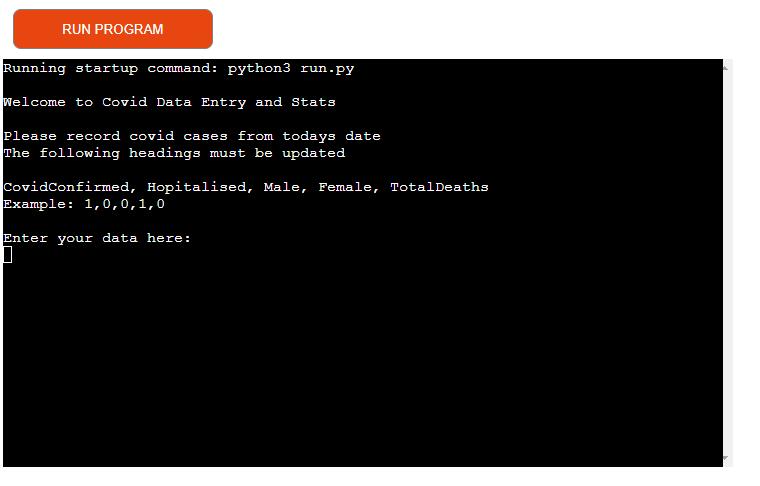
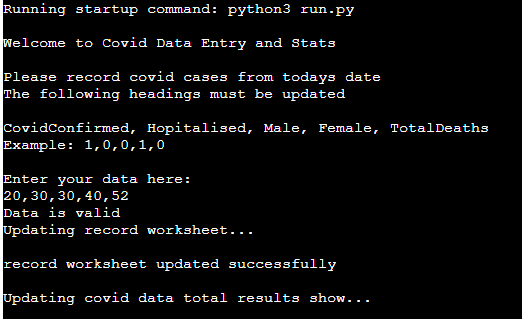
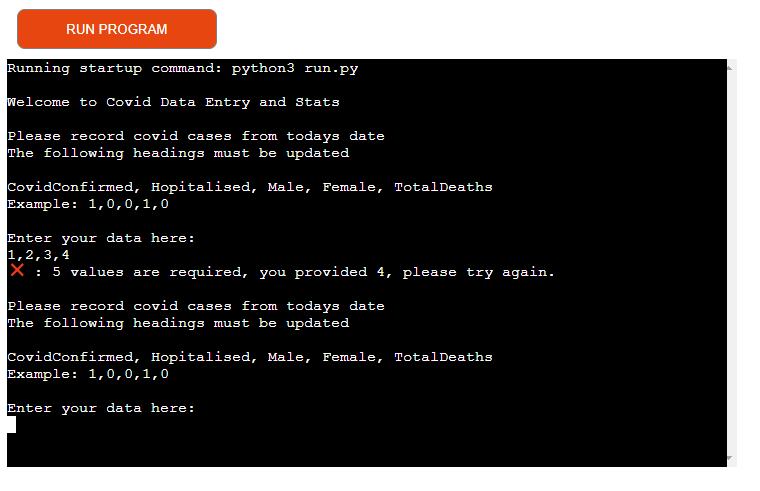
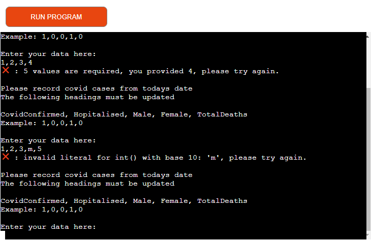
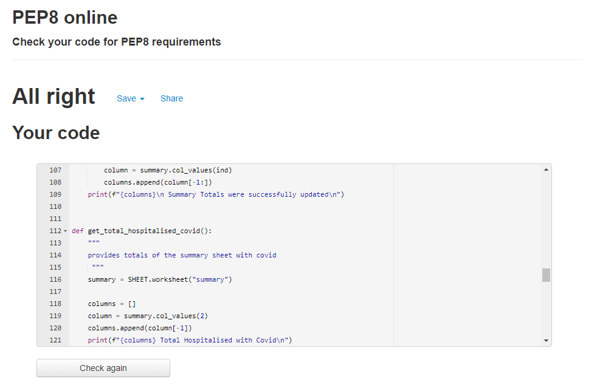

# Covid Data Tracker 

[Link to Covid Data Tracker](https://covid-data2022.herokuapp.com/)

# 1. Project Goals
The goal of the project was to create a database application that could be used to record covid data. During the pandemic the news use to update the country on numbers stats etc. The application should allow a user to record the daily cases of covid and provide a updated summary once that data has been inputted. 

##  How to use the tracker
Once the application is opened in Heroku the terminal will request the user to provide inputs. 

[Read more about the Covid here](https://en.wikipedia.org/wiki/COVID-19)

# 2. User Experience

## 2.1 User Stories 
1. As a user, I want to be able to enter in the daily Covid data. 
2. As a user, I want the daily data to update the overall summary data.
3. As a user, I want to see my inputs.
4. As a user, i want my excel to update once i have all my inputs entered.
5. As a user, I want to be able to see the totals per column eg, Covid Confirmed Cases, Hospitalisations, Male, Female and Total Deaths after the data has ran.
6. As a user, I want to know if i have entered in too many or too few inputs. 
7. As a user, I want to know if I have made an error and recieve feedback on ho to correct this. 

# 3. Features

## 3.1 All features

1. Welcome page:

- Welcomes the user and requests the Covid Data inputs. 

2. Results 

- The Data is entered and the data is checked to make sure it is valid. So that there are the required number of inputs which is 5 and that all the inputs are numbers.
- If four numbers were entered the following error message would appear. 

- Also if a letter was entered instead of a number then the following message would appear. 

## 3.2 Features to implement:

# 4. Technologies used 
* [Python](https://en.wikipedia.org/wiki/Python_(programming_language)) - Content and structure
* [Heroku](https://id.heroku.com/login) - Host
* [Gitpod](https://www.gitpod.io/) - Coding workspace
* [Github/ Github pages](https://github.com/)- Commit my code
* [Am I responsive?](http://ami.responsivedesign.is/#)- To see display the website as mock ups  
* 
* 

# 5. Testing 
- I used [PEP8 Python Validator](https://validator.w3.org/#validate_by_input) to check python code for errors 
- PEP8 code validator and returned no errors

- Throughout the project developement i was contineously testing through print statements on the gitpod terminal. 
- Continued testing on Heroku to try to improve the appearance of the data.

# 6. Bugs
- I came accross few bugs. 
1. creds.json file
- initally when i set up the excel file to link it to the gitpod environment i never pinned it. So i left if for a week and came back to it and the creds.json file that i had in my gitignore had disappeared. Once i figured it out i copied over the creds file again and that fixed the issue. 
2. Trailing whitespace 
- I had a large number of trailing white space so i fixed that.
3. Flake8 error messages
- I just changed to flake8 linter to fix the errors. 
4. Gitpod.yml - jupyter extension is not synced.
- I have not fixed this as it is a known error and does not cause the code any problems. 

## 6. Deployment

Steps for deployment:
1. Clone this repository in Github
2. Create [Heroku](https://dashboard.heroku.com/apps) app
3. Under settings tab, add Python and Node.js buildpacks in this order
4. Under settings tab, add PORT and 8000 to config vars.
5. Under deploy tab, link the Heroku app to this repository.
6. Deploy app

## 7. Credits